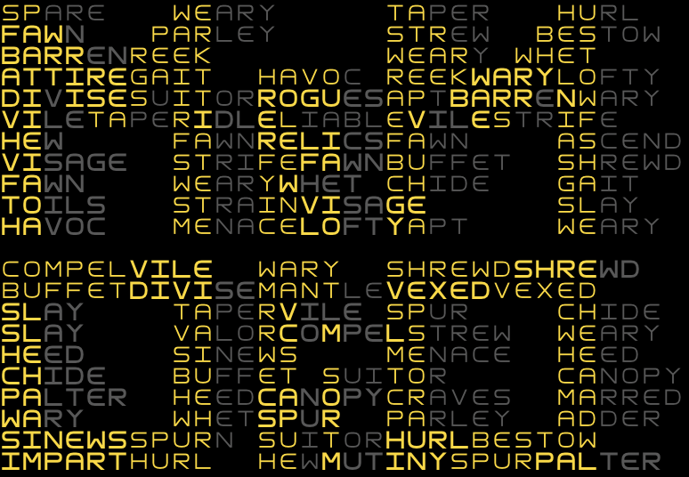

# Memorio
Work in progress althernative to Memrise.

All of the vocablary and their corresponsing data is stored in json files along with a papameter that indicates how unfamiliar you are with the term. As you play the different gamemodes, that parameter will decrease, lowering the probability of that term to appear, while boosting proability of those you know less.

## Usage

